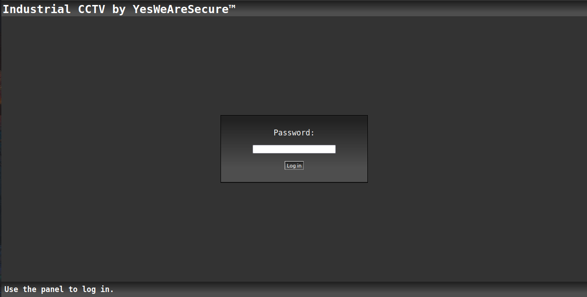
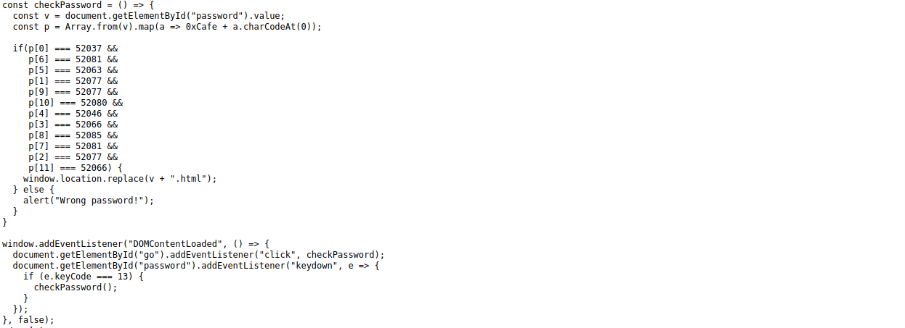
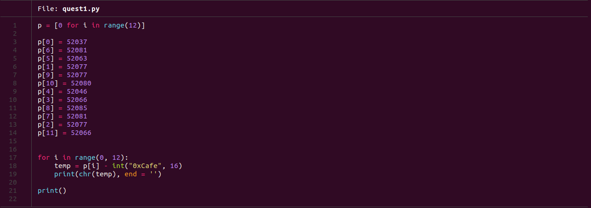
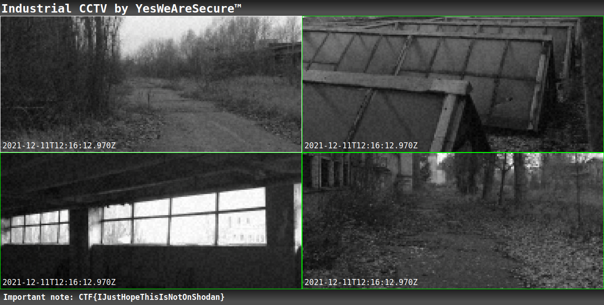

#  Novosibirsk - Chemical plant 

This is the first challenge of the Google Quest 2021.

### Challenge Description:
  You have now investigated the chemical plant. Nothing seemed to be out of the ordinary, even though the workers acted somewhat passive,
  but that’s not a good enough to track. It seems like you have a new voice mail from the boss: "Hello there, AGENT! It seems like the
  corporation that owns the plant was informed by an anonymous source that you would arrive, and therefore they were prepared for your visit,
  but your colleague AGENT X has a lead in Moscow, we’ve already booked you a flight. FIRST CLASS of course. In fact if you look out of the
  window, you should be able to see a black car arriving now, and it will carry you to the airport.
  Good luck!"
  
  Website Link: [https://cctv-web.2021.ctfcompetition.com/](https://cctv-web.2021.ctfcompetition.com/)
  
  This Challenge comes under the category of `web`.
  
  
### Solution:
  The quest seems pretty simple and straight forward. We need to enter the password
  in order to login the service.
  
  
  
  A quick look at the source code tells us it uses javascript to check the password.
  
  
  
  The password entered in first converted to ASCII using `a.charCodeAt(0)` and the hex value `0xCafe` is added to it.
  This process is used for all the characters in the password string. Then, each value is checked to hard coded values 
  using `and` operation and login is determined.
  
  
  
  I created a simple python script to reverse the login process. The script declares a list of length 11 and fills it with the values mentioned in the 
  source code of the website. Then, it iterates though the whole array and subtracts the hex value `0xCafe` from each element. The difference is then
  converted to char and printed out on the terminal.
  
  Easily, we get the password of the login.
  
  ```bash
    GoodPassword
  ```
  
### Flag:
  Using the password we obtained from the list, we log in to the service.
  
  
  
  The Flag is:
  
    `CTF{IJustHopeThisIsNotOnShodan}`
