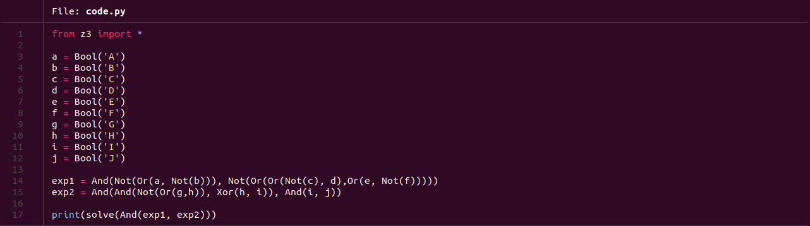
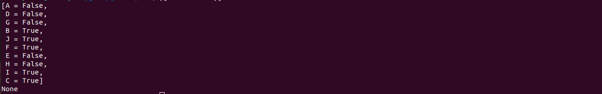
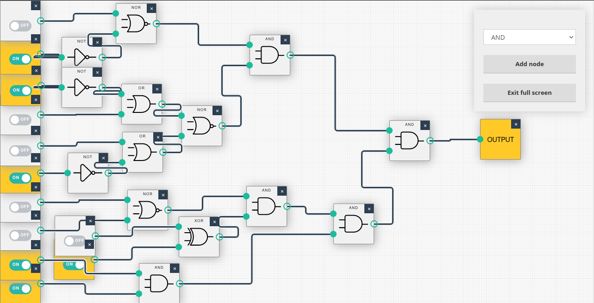

#  Moscow - Apartment 

This is the Second Challenge of the Google Beginner Quest 2021.

### Challenge Description:
  Well, it’s a rather gloomy and messy apartment, a faint shade is cast from the almost covered master window upon the worn wall. 
  It smells very burnt, and there's a cracked bottle in the sink that suggests some kind of experiment. Someone must have left in 
  a hurry. Thinking about it, do you want to: Look at the beautiful view of the Kremlin from the window or search the apartment 
  thoroughly.
  
  ##### Look at the beautiful view of Kreml, from the window.
  Wow look at the Kremlin. Ah, the Moscow Kremlin is really something else! But hey wait... look at the street, someone just started 
  to run when he saw you in the window. Could it be the person that we’re looking for? You exit the building and see that they are jumping 
  on a motorcycle and they take off! You spot a parked car, hotwire it and quickly take up the chase.
  
  ##### Search It Thoroughly.
  AGENT X seems to have missed that a plank on the floorboard has become very loose. You have a look and you see some kind of device under it. 
  If you’re lucky, some information on it might come in handy. You have to travel back to the base if you wish to find out more. 
  
  This challenge has a downloadable part.
  
  This challenge comes under the category of `misc`.
  
### Solution:
  This challenge gives us a zip file as a downloadable part. On extracting the file, we get a folder containing an image (.png), which is a 
  picture of combination of some logic gates.
  
  
  
  The challenge is pretty straight forward, we need to figure out the intial configuration to make the final output a 1.
  There are a number of ways to solve the challenge. One can simply take a pen and paper and start solving the circuit backwards, or use a Logic Gate
  Simulator to try to figure out which combinations work and sort them in ascending order.
  An interesting approach is to use Python.
  
  Z3 is a high performance theorem prover developed at Microsoft Research and is used for software/hardware verification and testing, constraint solving, 
  analysis of hybrid systems, security, biology (in silico analysis), and geometrical problems. It can also be used to solve complex logic gates.
  
  To install Z3, run the following commands:
  ```bash
    $> pip3 install z3 z3-solver
  ```
  
  
  
  The python code is fairly simple. We start by importing Z3 and defining ten boolean variables from A-J, just like in our problem statement.
  Expression 1 everything for the first input of the last `AND` gate and Expression 2 is the latter. All the gates are written from left to right,
  thus we start with the 'AND' gate taking the previous `NOR` gate output, which again takes arguments A and `NOT` B. Same goes for the second input of the 
  `AND` gate. A quick thing to note here is that Z3 does not have a separate `NOR` gate thus I've written `Not(OR(arg1, arg2))` instead.
  Expression 2 goes the same way as Expression 1.
  Then we've Z3's to solve function the boolean expression `AND(Expression1, Expression2)`.
  
  
  
  Easy enough, we got our solution.
  
### Output:
  The final output is all the inputs that are high, in ascending order.
  
  I copied the circuit in a Logic Gate Simulator in order to check the output.
  
  
  
  The Flag is :
  
  ```
    CTF{BCFIJ}
  ```


