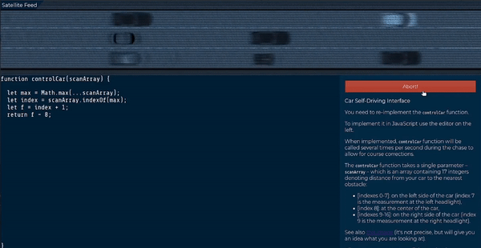

#  Moscow - Streets 

This is the third challenge of the Google Beginner CTF 2021.

### Challenge Description:
  You’re closing in on the motorcycle, but before you have time to act, the person turns to a small path, which is impossible to follow by car.
  You will never see them again, but wait... They dropped something, a small bag! You look inside of it, and you see what looks to be like 
  an ancient amulet. You return to AGENT X and she tells you that the amulet can be a lead, and that you should return to the base to begin some research.
  
  Website Link : [https://high-speed-chase-web.2021.ctfcompetition.com/](https://high-speed-chase-web.2021.ctfcompetition.com/)
  
  This challenge comes under the category of `programming`.
  
### Solution:
  This challenge seems tough at first but really is not that diffucult once you get a hang of it.
  Heading over to the website, we see the challenge description.
  ```bash
        Car Self-Driving Interface
        
        You need to re-implement the controlCar function.
        To implement it in JavaScript use the editor on the left.
        When implemented, controlCar function will be called several times per second during the chase to allow for
        course corrections.
        The controlCar function takes a single parameter – scanArray – which is an array containing 17 integers denoting 
        distance from your car to the nearest obstacle:

            [indexes 0-7]: on the left side of the car (index 7 is the measurement at the left headlight),
            [index 8]: at the center of the car,
            [indexes 9-16]: on the right side of the car (index 9 is the measurement at the right headlight).

        All measurements are parallel to each other.
        A negative measurement might appear if the obstacle is very close behind our car.
        The controlCar must return an integer denoting where the car should drive:

            -1 (or any other negative value): drive more to the left,
            0: continue straight / straighten up the car,
            1 (or any other positive value): drive more to the right.
  ```
  
  The accompanying image helps us get a better idea at the question.
  
  
  
  The computer gives us an array of length 15, as shown in the above image. Our car is always at the center of the array, i.e. at index 8.
  The positive elements of the array tells us the distance of our car from the cars infront of us and negative numbers tells us the distance 
  from the cars behind us. The challenge is to prevent the collision of cars.
  
  The car moves up if a negative number is returned, remains at the same lane if 0 is returned and moves down if a positive number is returned.
  Of course, we need to give a value to tells our code by how much we need to move up or down.
  
  My approach to the problem was to change the car to the lane where we are at maximum distance from other cars. Meaning, we need to find the 
  first occurance of the largest element in the array, move 1 down the index(since the car requires 3 indexes to represent the body) and return the 
  difference from our position, i.e. 8.
  
  For example, in the image shown above, the program would search for the maximum element in the array, which is 74 in this case. Thus, we know that we
  should be at index 4 to be exactly behind the farthest car.
  We return the difference of the extracted index and our current position. In this case it will be `4 - 8` which is equal to `-4`, thereby telling the 
  program to move the car 4 spaces up.
  
  Here's my code for the solution.
  
  ```javascript
   function controlCar(scanArray) {
        let max = Math.max(...scanArray);
        let index = scanArray.indexOf(max);
        let f = index + 1;
        return f - 8;
  }
  ```
  
### Flag:
  Once the code is executed, we can see the car going down the street without any collisions.
  
  
  
  Check out the full journey of the car [here](https://raw.githubusercontent.com/samsepi0x0/GoogleBeginnerQuest/main/Quest3/full_output.mp4).
  
  Flag:
  
   ```
      CTF{cbe138a2cd7bd97ab726ebd67e3b7126707f3e7f}
   ```
