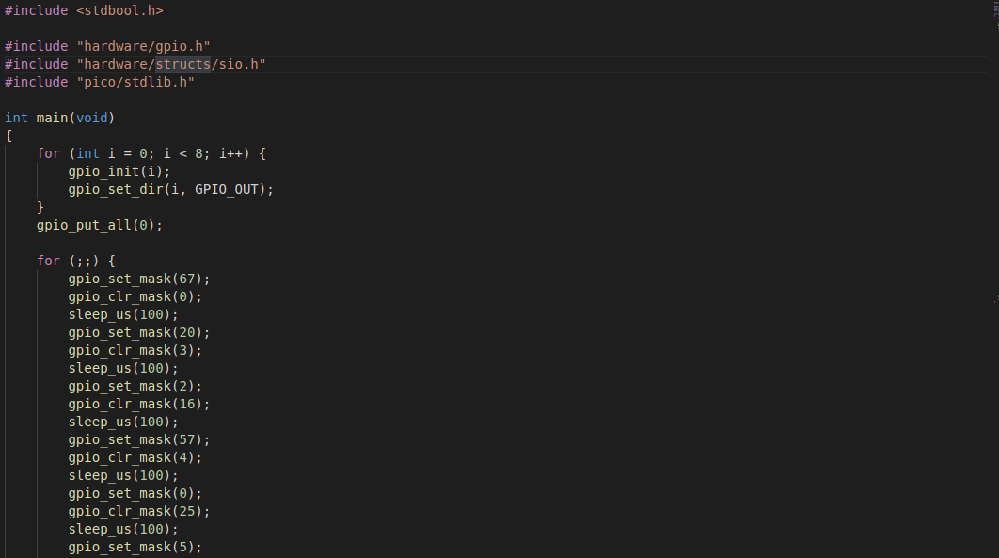

#  Secret Location - Base 

This is the fourth challenge of the Google Beginner Quest 2021.

### Challenge Description:
  You’re taking a stroll in the lab, when Dr. Klostermann is calling your name: "Agent, we’ve discovered the origin of the device. 
  This time you won’t be able to reach your destination by air, but by the new Trans-Sibiriean Railway, as opposed to the old one, 
  which runs along side it at the same time, it is a bit odd. And it goes to Shenzhen. I am sorry agent, but the further you go into 
  this task, the more precautions you will have to take, and remember, the enemy can be anyone. It could be a conductor, the engineer, 
  it could even be our own people that will meet you at the spot you need to be at. Be selective with who you trust. I think you got the
  point, go now, I got much to do. Agent, much depends on you!."
  
  This challenge has a downloadable part.
  
  This challenge comes under the category of `miscellaneous`.

### Solution:
  We get a zip file in this challenge, which on extraction, gives us two files - `chal.c` and `pico.uf2`. A quick analysis of C program tells us
  that it uses the `gpio` header files for setting and clearing the pins. GPIO stands for General Purpose Input/Output and is a type of pin found on 
  an integrated circuit that does not have a specific function. While most pins have a dedicated purpose, such as sending a signal to a certain component, 
  the function of a GPIO pin is customizable and can be controlled by software.
  
  
  
  Bitmasking operations are used to turn a bit on from off or vice-versa, or check if a bit is on or off and for toggling a bit. But what does Bitmasking
  has to do with this challenge. We can define a Pin, initially at 0, and them set the pin to all the values the C program mentions and also clear the values
  just like the C program does. Bitmasking eases the task of setting and clearing the pins.
  
  We can set mask using operation:
  
                                                             Pin |= mask
                    
  We can clear mask using operation:  
  
                                                             Pin &= ~mask
                                                                          
  Read more about bitmasking [here](https://www.codespeedy.com/bit-masking-in-cpp/).
  
  The script starts by declaring a global pin and setting it to 0. The `gpio_set_mask(mask)` sets the mask on the global pin and `gpio_clr_mask(mask)`
  clears the mask from the global pin.Then, we call the functions in the same order as the original program and everytime we clear the pin, we display the
  pin (converting the ASCII value to text).
  
### Output:
  On running the python script, we get the flag as an output.
  
  
  
  Flag:
  
          CTF{be65dfa2355e5309808a7720a615bca8c82a13d7}
