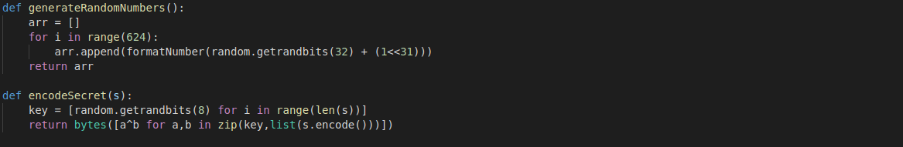
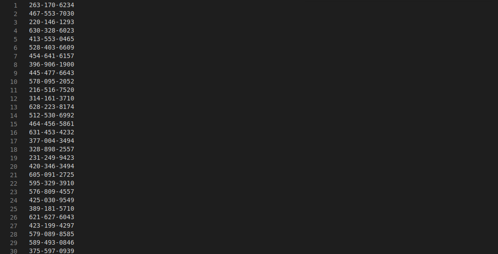
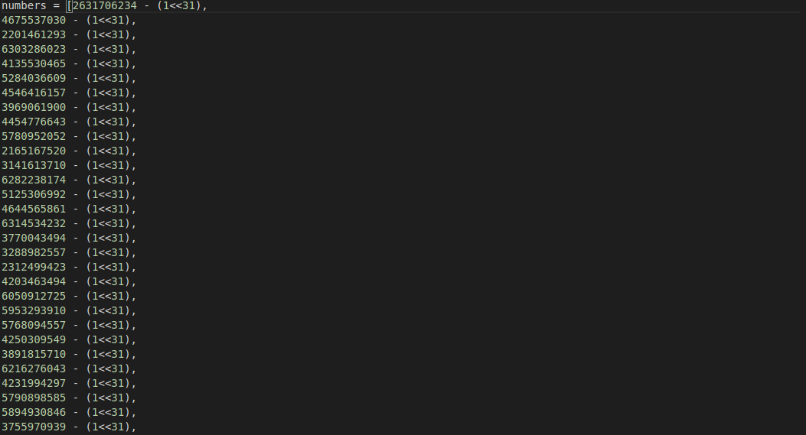

# Istanbul - Bazaar 

This is the Fifth Challenge of the Google's Beginner Quest 2021. Do check out [Gynvael's](https://www.youtube.com/watch?v=RsfjKZsJGgo) awesome video if you want to know a more detailed video.

### Challenge Description:
  It’s a hot day, and your skin is cracking and dry. It’s difficult to make your way through the crowded bazaar. A high pitch voice pierces 
  through the soundscape from a salesman that’s trying to sell colorful fabrics and then from another corner comes delicious smells. You spot 
  a hand waving - it’s your contact that you’ve been waiting to meet. "Take a seat, my friend, I’m Gökhan, have you been to Istanbul before? 
  No, really? I’m sure that you will have a great time, I’ve ordered tea for the two of us. Show me the amulet, will you?. Wow, this is really 
  something from my younger days, this is as mysterious as it is beautiful and belongs to “The cloaked brotherhood”. They are very dangerous, 
  and eventhough your quest is urgent, I would advise you to not continue looking for the owner of this. Go home, and forget about it." In the 
  blink of an eye, four tough guys show up, and you start to run together with Gökhan through the crowded marketplace and then up on a rooftop. 
  The tough guys are closing in, but the two of you climb down from the rooftop, run around a corner and are able to hide in two crates.

  ##### Challenge: Twisted robot
  We found this old robo caller. It basically generates random phone numbers to spam. We found the last list of numbers in generated and also 
  some weird file... Maybe it's got to do with these new beta features they were testing?
  
  This challenge comes under the catgory of `misc`.
  
  This challenge has a downloadable part.
  
### Solution:
  This is a fun solution to begin with. On extracting the zip file, we see 3 files `RoboCaller1337.py`, `robo_numbers_list.txt` and `secret.enc`.
  
  
  
  The `generateRandomNumbers()` function takes no input and generates 624 random numbers and adds 1 << 31 (2147483648) to it. The it formats the generated
  numbers to XXX-XXX-XXXX format and stores them to the `robo_numbers_list.txt`. 
  
  
  
  Now, lets talk about `encodeSecret(arg1)`, which takes 1 argument and returns the XOR of the bytes of the argument with random numbers generated. The `secret.enc`
  file contains the XOR'd values as bytes. The key to solve this problem is to know the seed of the random function generator, which will help us know the exact
  values the function would generate. (random.getRandbits() uses the `Mersenne Twister` algorithm to generate pseudo random numbers).
  
  A quick google search to find the Mersenne Twister seed recovery gives us the link to [this](https://github.com/eboda/mersenne-twister-recover) repository, which
  gives a detailed explanation about how the recovery is done. Basically, we need atleast 624 values from the random number generator in order to recover the seed.
  But lo, we already are given 624 values. We just need to format them and subtract 1 << 31 from each of the values in order to get the original state.
  
  
  
  I removed the `-` from the values, subtracted 1<<31 from each value and converted the whole text file into a big python list. After that, we clone the [repo](https://github.com/eboda/mersenne-twister-recover)
  to get the Recovery function. Following the README.md and Gynvael's walkthrough, we create a python script that uses the recovery function to generate the exact
  random bits used for XOR.
  The properties of XOR which helps us get the original message:
  
                                        [Message] ^ [Key] = [CipherText]
                                        [CipherText] ^ [Message] = [Key]
                                        [CipherText] ^ [Key] = [Message]
                                        
  In our case, we already have the CipherText and the Keys, so XORing the gives us the original message.
  
  Here's the code:
  ```python
      from MTRecover import MT19937Recover
      from robo_numbers import numbers

      def decodeSecret(s, random_state):
          key = [random_state.getrandbits(8) for i in range(len(s))]
          return bytes([a^b for a,b in zip(key,s)])

      def main():
          mtr = MT19937Recover()
          r_gen = mtr.go(numbers)

          with open("secret.enc", 'rb') as f:
          s = f.read()

          flag = decodeSecret(s, r_gen)
          print(str(flag, 'UTF-8'))

      if __name__ == "__main__":
          main()
   ```
   The program starts with importing the `MT19937Recover` class from `MTRecover` and the list we created, containing the 624 numbers generated originally.
   The `decodeSecret()` takes two arguments, 1st is the message to be decoded and 2nd is the random state which will generate the random numbers for that state.
   The `main()` function creates the object of MT19937Recover and `r_gen` stores the random state for the 624 numbers. Then it's just the calling the decode function
   which takes the encoded message and the random state and does exactly what encodeSecret does.
   
### Flag:
   On running the code, we simply get the flag.
   
   
   
   Flag:
          
          CTF{n3v3r_3ver_ev3r_use_r4nd0m}
   
   
