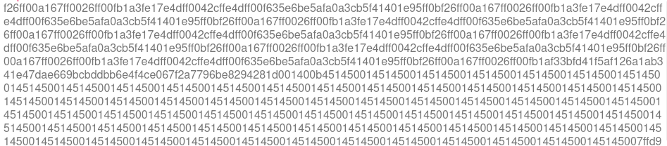
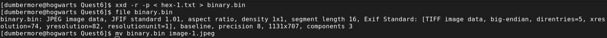
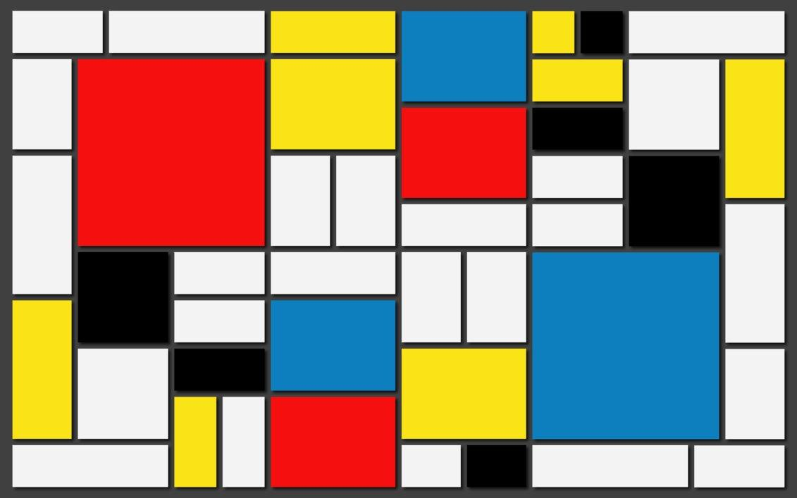
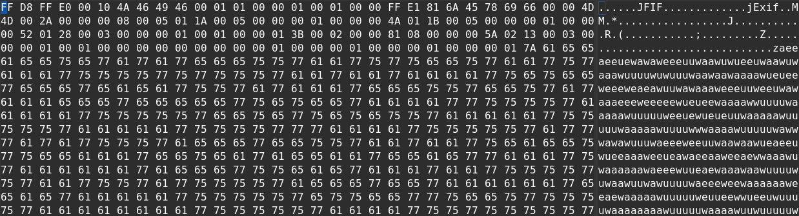

#  Shenzhen - Office 

This is the sixth challenge of the Google Beginner Quest 2021.

### Challenge Description:
  This one is a doozie. We found this weird file on a memory stick with a post-it note on it. It looks like someone was working on a very obscure encryption system. Maybe we can decode it? 
  
  This challenge has a downloadable part.
  
  This challenge comes under the category of `misc`.
  
### Solution:
  On extracting the downloaded zip provided, we find 2 files: `chall.txt` and `encodings`. `chall.txt` has some text written in non-English language and `encodings` gives us some hints related to the challenge.
  
  
  Part view of `chall.txt`.
  
  The hints provided in `encodings` is listed below:
  ```text
        I made a super secret encoder. I remember using:
          - a weird base, much higher than base64                   <--- maybe base128 or something like that
          - a language named after a painter                        <--- PIET
          - a language that is the opposite of good                 <--- EVIL maybe PHP?
          - a language that looks like a rainbow cat                <--- I know enough memes to know this is nyan cat
          - a language that is too vulgar to write here             <--- No brain required here, It's brainf**k
          - a language that ended in 'ary' but I don't remember the full name <--- Binary ends with ary, unary ends with ary,
                                                                            dont know what this means.

       I also use gzip and zlib (to compress the stuff) and I like hiding things in files...
  ```
  
  So looking at the hints, its obvious that they don't make much sense with the data give. So let's look at hint-1, a weird base.
  
  A quick google search tells us that the valid bases much higher than base64 include `Base2048`, `Base32768`, `Base65536` and many more.
  After a lot of try and catch, I figured out that the base required here is `Base65536`. [Better-Convertor](https://www.better-converter.com/Encoders-Decoders/Base65536-Decode) has a tool that can decode this base.
  
  Copy-pasting the text provided, we get some hex values.
  
  
  
  We know these values are correct as they are valid hex strings.
  
  Converting these values into binary file, we get a jpeg file.
  
  
  
  The image file generated is the famous PIET painting, confirmed by my googling skills.
  
  
  
  Looking at this image in a hex-editor, we see some weird values which are not generally present in a standard JPEG file.
  
  
  
  This data can also be viewed when using exiftool on the image.(Comes under the heading of Author).
  Once again, we take a look at the hint's given because this is some weird language.
  The second hint says `the opposite of good`, that's evil. Luckily, there is a language called `EVIL`, which has the same syntax as the text extracted from
  the image. I found [evil](https://esolangs.org/wiki/Evil) on [esolangs.org](esolangs.org). It is a cool collection of all the weird languages that have been
  developed over the years by various people.
  
  Anyways, I found the interpreter for this language [](https://web.archive.org/web/20070103000858/www1.pacific.edu/~twrensch/evil/index.html) on the wayback machine, because the github link was dead. It gave us the java implementation of the interpreter.
