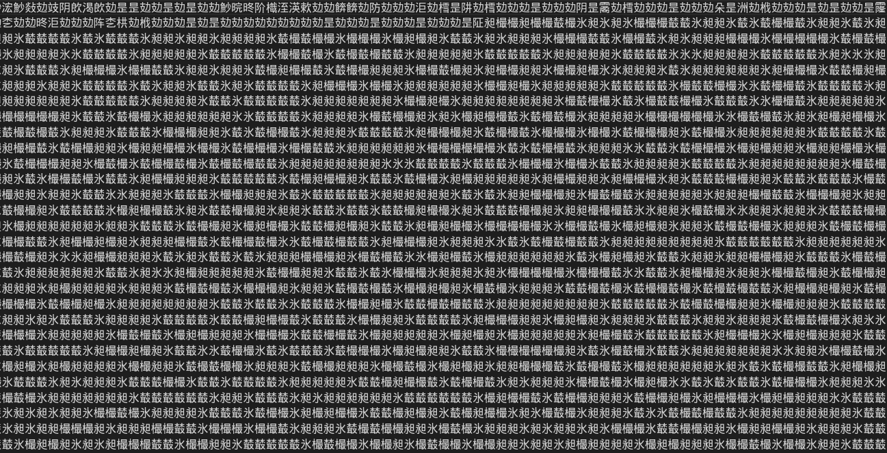

#  Shenzhen - Office 

This is the sixth challenge of the Google Beginner Quest 2021.

### Challenge Description:
  This one is a doozie. We found this weird file on a memory stick with a post-it note on it. It looks like someone was working on a very obscure encryption system. Maybe we can decode it? 
  
  This challenge has a downloadable part.
  
  This challenge comes under the category of `misc`.
  
### Solution:
  On extracting the downloaded zip provided, we find 2 files: `chall.txt` and `encodings`. `chall.txt` has some text written in non-English language and `encodings` gives us some hints related to the challenge.
  
  
  Part view of `chall.txt`.
  
  The hints provided in encodings is listed below:
  ```text
        I made a super secret encoder. I remember using:
          - a weird base, much higher than base64
          - a language named after a painter
          - a language that is the opposite of good
          - a language that looks like a rainbow cat
          - a language that is too vulgar to write here
          - a language that ended in 'ary' but I don't remember the full name

       I also use gzip and zlib (to compress the stuff) and I like hiding things in files...
  ```
  
