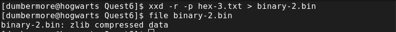
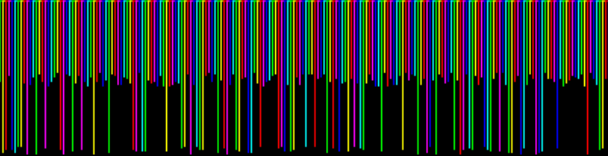
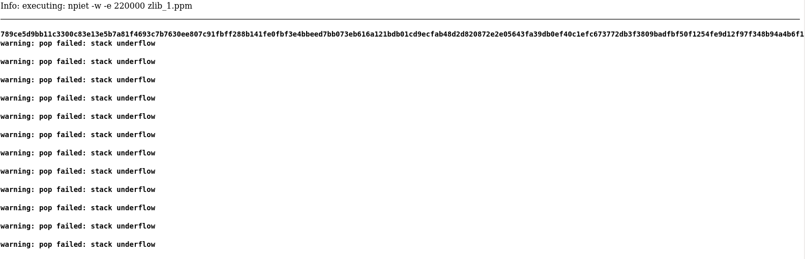
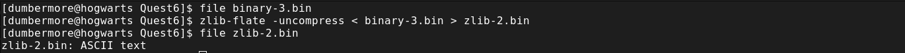
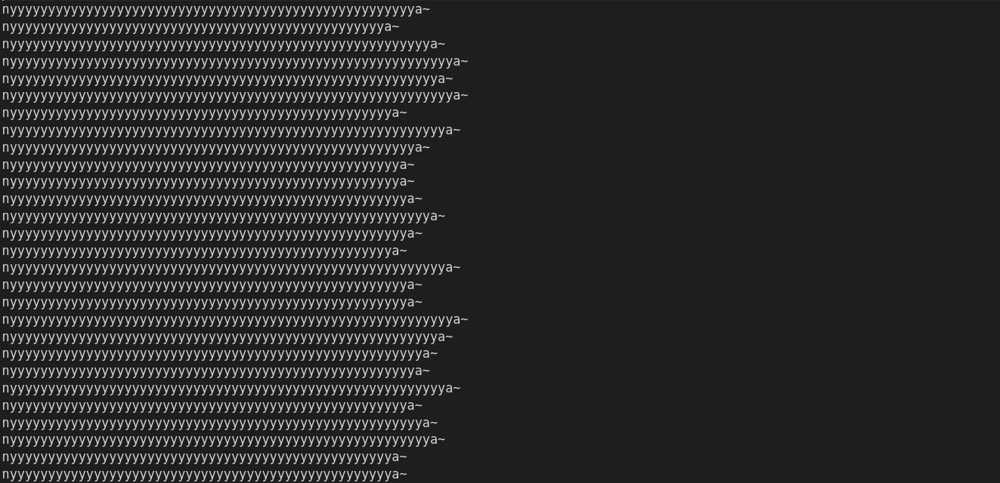
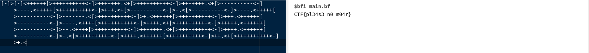

#  Shenzhen - Office 

This is the sixth challenge of the Google Beginner Quest 2021.

### Challenge Description:
  This one is a doozie. We found this weird file on a memory stick with a post-it note on it. It looks like someone was working on a very obscure encryption system. Maybe we can decode it? 
  
  This challenge has a downloadable part.
  
  This challenge comes under the category of `misc`.
  
### Solution:
  On extracting the downloaded zip provided, we find 2 files: `chall.txt` and `encodings`. `chall.txt` has some text written in non-English language and `encodings` gives us some hints related to the challenge.
  
  
  Part view of `chall.txt`.
  
  The hints provided in `encodings` is listed below:
  ```text
        I made a super secret encoder. I remember using:
          - a weird base, much higher than base64                   <--- maybe base128 or something like that
          - a language named after a painter                        <--- PIET
          - a language that is the opposite of good                 <--- EVIL maybe PHP?
          - a language that looks like a rainbow cat                <--- I know enough memes to know this is nyan cat
          - a language that is too vulgar to write here             <--- No brain required here, It's brainf**k
          - a language that ended in 'ary' but I don't remember the full name <--- Binary ends with ary, unary ends with ary,
                                                                            dont know what this means.

       I also use gzip and zlib (to compress the stuff) and I like hiding things in files...
  ```
  
  So looking at the hints, its obvious that they don't make much sense with the data give. So let's look at hint-1, a weird base.
  
  A quick google search tells us that the valid bases much higher than base64 include `Base2048`, `Base32768`, `Base65536` and many more.
  After a lot of try and catch, I figured out that the base required here is `Base65536`. [Better-Convertor](https://www.better-converter.com/Encoders-Decoders/Base65536-Decode) has a tool that can decode this base.
  
  Copy-pasting the text provided, we get some hex values.
  
  
  
  We know these values are correct as they are valid hex strings.
  
  Converting these values into binary file, we get a jpeg file.
  
  
  
  The image file generated is the famous PIET painting, confirmed by my googling skills.
  
  
  
  Looking at this image in a hex-editor, we see some weird values which are not generally present in a standard JPEG file.
  
  
  
  This data can also be viewed when using exiftool on the image.(Comes under the heading of Author).
  Once again, we take a look at the hint's given because this is some weird language.
  The second hint says `the opposite of good`, that's evil. Luckily, there is a language called `EVIL`, which has the same syntax as the text extracted from
  the image. I found [evil](https://esolangs.org/wiki/Evil) on [esolangs.org](esolangs.org). It is a cool collection of all the weird languages that have been
  developed over the years by various people.
  
  Anyways, I found the interpreter for this language [](https://web.archive.org/web/20070103000858/www1.pacific.edu/~twrensch/evil/index.html) on the wayback machine, because the github link was dead. It gave us the java implementation of the interpreter.
  
  This java file, once compiled, returns the value of the text written in evil programming language.
  A key point to note here is that, while compiling the `evil.java` file, it might give out an error like:
  ```bash
  Error: LinkageError occurred while loading main class evil
	java.lang.UnsupportedClassVersionError: evil has been compiled by a more recent version of the Java Runtime (class file version 61.0), this version of the Java         Runtime only recognizes class file versions up to 55.0
  ```
  
  This is because the code was written when javac version 55 was used and the compiler we are using is different from the one intended.
  This issue can be resolved during compilation time, by mentioning the version we want. For instance:
  ```bash
  $> javac --release 8 evil.java
  $> java evil.java weird-lang-1.txt > hex-3.txt
  ```
  This should run perfectly.
  
  This file once again gives us a hex-output, and once again we convert it to a binary file and check its properties using `file` command.
  

  Oh cool! A zlib-compressed file. Let's uncompress it using zlib-flate:
  ```bash
  $> zlib-flate -uncompress < binary-2.bin > zlib-1.bin
  ```
  
  Checking the file type of `zlib-1.bin`, its a gzip file. That's no problem because it can be decompressed using gzip command:
  ```bash
  $> mv zlib-1.bin zlib-1.gz
  $> gzip --decompress zlib-1.gz
  ```
  
  The `zlib-1` file thus created is a `PPM` file (A pixelmap).
  
  
  `zlib-1.ppm` contains the whole pixelmap, the above picture is just a part of the whole map.
  
  This ppm file is actually code written in `PIET programming language`. More information about that [here.](https://esolangs.org/wiki/Piet)
  Piet has a lot of interpreters for pixelmaps and jpegs and all sorts of image file format, I just used the one mentioned in `esolangs.org` to convert the ppm to 
  valid text.
  
  You can download the tar files, make the C executable and run the code against the ppm file, but that's a lot of work so I just used the online interpreter
  I found [here.](http://www.bertnase.de/npiet/npiet-execute.php)
  
  

  We get some error, but we also get some hexadecimal value. Copying them and converting them to a binary file, we once again get a zlib compressed file.
  
  
  
  This ASCII file contains the following text:
  
  
  On confirming at [esolangs.org](https://esolangs.org/), this is indeed a code written in `nya` language. More information on this language can be found [here](https://esolangs.org/wiki/Nya~).
  
  I found an interpreter of nya on github. Using that, we can convert the nya text to something understandable.
  ```bash
  $> git clone https://github.com/sech1p/nya.git
  $> cd nya
  $> make
  $> ./build/nya ../zlib-2.txt > ../decimals.txt
  ```
  
  Output:
  ```
  440697918422363183397548356115174111979967632241756381461523275762611555565044345243686920364972358787309560456318193690287799624872508559490789890532367282472832564379215298488385593860832849627398865422864710999039787979733217240717198641619578634620231344233376325369569117210379679868602299244468387044128773681334105139544596909148571184763654886495124023818825988036876333149722377075577809087358356951704469327595398462722928801
  ```
  
  Using the above commands, we obtained a sequence of integers. Looking back at the hints given to us, only the last hint remains unsolved.
  Languages ending in `ary`, it could be unary. Unary is an esoteric programming language, that is a slight modification of yet another esoteric 
  language `BrainFuck`. More information on Unary can be found [here.](https://esolangs.org/wiki/Unary)
  
  Basically, the sequence provided to us is the decimal interpretation of the binary numbers. Once we get the original binary sequence, we need to split them in groups of three, and then, using the lookup table provided at [esolangs.org](https://esolangs.org/wiki/Unary), convert them to proper Brainfuck syntax.
  
  The python script used for this conversion is this one:
  ```python
    k = 440697918422363183397548356115174111979967632241756381461523275762611555565044345243686920364972358787309560456318193690287799624872508559490789890532367282472832564379215298488385593860832849627398865422864710999039787979733217240717198641619578634620231344233376325369569117210379679868602299244468387044128773681334105139544596909148571184763654886495124023818825988036876333149722377075577809087358356951704469327595398462722928801
    s = str(bin(k))[3:]
    table = {
        "000" : ">",
        "001" : "<",
        "010" : "+",
        "011" : "-",
        "100" : ".",
        "101" : ",",
        "110" : "[",
        "111" : "]"
    }
    for o in range(0, len(s), 3):
        print(table[s[o:o+3]], end='')
  ```
  
  Using the above script, we get the proper brainfuck code.
  Now we just need to find the interpreter for brainfuck and convert the code. I found [this](https://www.tutorialspoint.com/execute_brainfk_online.php) one quite authentic.
  
### Flag:
  On interpreting the brainfuck file, we get the flag.
  
  
  
  Flag in text format:
  
  	
	CTF{pl34s3_n0_m04r}
	
