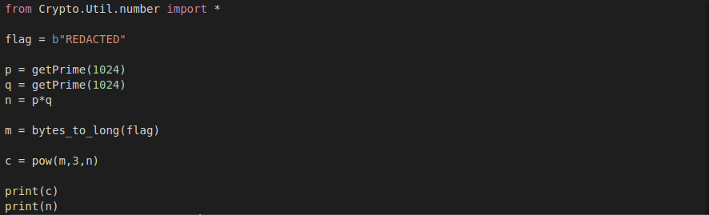

#  Buenos Aires - Conference 

This is the 7th challenge of Google CTF Beginners Quest 2021.

### Challenge Description:
  You are showing the invitation so that you can enter the conference. There are hundreds of important looking people at the conference. 
  You take a glass of champagne from a tray, and try to look important yourself. After being busy with trying to look important for a few minutes, 
  you approach the person that you are here to get classified information from. He introduces himself as Dr. Nowak Wasilewski. Nowak asks who you are, 
  and if you can prove your knowledge through a test that he has designed by himself.
  
  #### Challenge: ReadySetAction
  Apparently this script was used to encrypt super secret messages. Maybe there is something interesting in it? NOTE: this challenge was previously broken, 
  redownload to get the correct file.
  
  As you might have guessed, this challenge has a downloadable part.
  
  This challenge comes under the category of `crypto`.
  
### Solution:
  A quick look at the zip files reveals a python code, which is a RSA encryptor program.
  
  
  
  If you're not familiar with RSA Encryption check out [Wikipedia](https://en.wikipedia.org/wiki/RSA_(cryptosystem)) or this [pdf](https://github.com/samsepi0x0/GoogleBeginnerQuest/blob/main/Quest7/paper_1_17152_649.pdf).
  Basically we are given public key, cipher text and `e`, which is used to encode the secret message(converted to long from bytes) and encoded
  using the formula:
  
                  c = m ^ e (mod n)
                  
  This is actually a good challenge because the values of `n` and `c` are pretty large, therefore cannot be factored easily. But there's a catch,
  the value of `e` is so small, the we can find the eth root of c.
  In order to find the eth root, we first need to open the `mod`. The way to do that is:
  
                 c = m ^ e (mod n)
                 m ^ e - c = k * n      (where k is a constant)
                 m = (c + k * n) ^ (1/e)
                 
  If you're not sure how mod is opened, check out this [pdf](https://www2.math.upenn.edu/~mlazar/math170/notes06-2.pdf). It will give you a basic idea
  of how mod works. Anyways, back to the problem, using the above formula, we can easily find the original message. We already know that the message starts
  with the literals `CTF`, so each time the message is calculated for a value of k, we can check if it starts with those literals.
  
  Code:
  ```python
  from Crypto.Util.number import *

def nth_root(x, n):
    upper_bound = 1
    while upper_bound ** n <= x:
        upper_bound *= 2
    lower_bound = upper_bound // 2
    while lower_bound < upper_bound:
        mid = (lower_bound + upper_bound) // 2
        mid_nth = mid ** n
        if lower_bound < mid and mid_nth < x:
            lower_bound = mid
        elif upper_bound > mid and mid_nth > x:
            upper_bound = mid
        else:
            return mid
    return mid + 1

def main():
    c = 15478048932253023588842854432571029804744949209594765981036255304813254166907810390192307350179797882093083784426352342087386691689161026226569013804504365566204100805862352164561719654280948792015789195399733700259059935680481573899984998394415788262265875692091207614378805150701529546742392550951341185298005693491963903543935069284550225309898331197615201102487312122192298599020216776805409980803971858120342903012970709061841713605643921523217733499022158425449427449899738610289476607420350484142468536513735888550288469210058284022654492024363192602734200593501660208945967931790414578623472262181672206606709
    n = 21034814455172467787319632067588541051616978031477984909593707891829600195022041640200088624987623056713604514239406145871910044808006741636513624835862657042742260288941962019533183418661144639940608960169440421588092324928046033370735375447302576018460809597788053566456538713152022888984084306297869362373871810139948930387868426850576062496427583397660227337178607544043400076287217521751017970956067448273578322298078706011759257235310210160153287198740097954054080553667336498134630979908988858940173520975701311654172499116958019179004876438417238730801165613806576140914402525031242813240005791376093215124477


    for k in range(2000):
        r = nth_root(c + k*n, 3)
        m = long_to_bytes(r)
        if b'CTF' in m:
            m = m.decode("UTF-8")
            print(m[:m.find("\x00")])
            break
  ```
  
  I found the `nth_root` function on [riptutorial](https://riptutorial.com/python/example/8751/computing-large-integer-roots), which uses binary search
  to find nth roots of large numbers.
  Rest of the code is very much self explanatory. For every value of `k`, we compute a message, check if its the one we want and continue.
  
### FLAG:
  On running the code file, we can see the output:
  
  
  
  FLAG:
  
              CTF{34sy_RS4_1s_e4sy_us3}     
              
