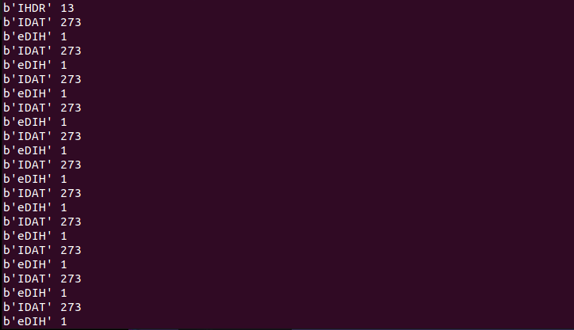

#  Croatia - Yacht 

  This is the 8th challenge in Google Capture the Flag Beginner's Quest 2021.
  
  ### Challenge Description:
   You arrive at the location through the coordinates that you got from the assassin, a luxurious yacht. A fat, bald man lies on a puma couch. He sips on a dry martini, smokes the biggest cigar you've ever seen and when he smiles, a golden tooth is revealed. You can’t help but smile back at him, although you think the place seems shady. "Welcome to my yacht, Johnson, finally you show us your face. Have you killed the AGENT now? Good! You’re here to collect your reward I presume? I’ll have my guy finalize the transaction but before you leave I need a small favour from you." It seems that he is mistaking you for the assassin but you don’t mind.
    
   #### Challenge: Hide and seek (misc)
   The man hands you a pendrive which you reluctantly connect to your laptop. He says he got it from a partner, and the partner claims that he hid valuable information in that PNG there. The problem is, it looks empty. See if you can find anything.
   
   This challenge has a downloadable part.
   
   This challenge comes under the category of `misc`.
  
  ### Solution:
   On downloading and extracting the zip, we see a PNG named `hideandseek.png`.
    
   
   
   Checking the file type, it is indeed a PNG and does not contain any hidden data. The image does not open when viewed in an image editor. So, it can be assumed that the 
   we might have to deal with the image data(headers and all) instead of regular steganography(the ones where pixel data is altered.)
    
   
   
   
   PNG Filetype has a pretty simple structure (Image from wikipedia.org).
   
   The first 8 bytes are the file headers, giving basic information like the filetype, or in ASCII letters `PNG`, allowing a person to identify the format easily if it is viewed in a text editor. 
   This information is not really useful for us, we are more interested in the `chunks` of the PNG file.
   Find out more information about PNG's [here](https://en.wikipedia.org/wiki/Portable_Network_Graphics).
   
   The chunks consists of 4 parts, the 4 byte length in BIG-ENDIAN, 4 byte chunk type/name, N bytes of chunk data(N defined in length) and the 4 byte CRC or checksum.
   We are mainly interested in the length of the chunks, the types of chunk and the data in the chunks. A simple python script would be sufficient to extract these things from the PNG.
   
   We start by opening the image in bytes and reading all the bytes, forming an array. Then we skip the first 8 bytes since they are not required in this challenge.
   Then, looping though the array of bytes, we start splitting the file into bytes, creating chunks of data, all having the same properties, the length of chunk(converted
   to big-endian ">I"), the type of chunk and the data in the chunk. The CRC or checksum is skipped, since we don't want to verify anything. The loop breaks when we find the `IEND` chunk type.
   Lastly, we print out all the chunk types and the length of data in each chunk type.
   
   
   
   All these chunk types look pretty standard except `b'eDIH'`, which I was not able to find on the wikipedia page. On closer inspection, the reverse of `eDIH` is `HIDe`,
   implying that this is the chunk whose data we need to look.
   
   
   
   The bytes end in `=` sign, meaning the flag is Base64 encoded. So, we just need to look at the data in this chunk, append it to a string and Base64 decode it.
   
   The final script looks something like this:
   
   ```python3
        import struct
        import base64
        
        f = open('hideandseek.png', 'rb').read()[8:]
        i = 0
        flag = b''
        
        while True:
            length = struct.unpack(">I", f[i:i+4])[0]
            types = f[i+4:i+8]
            chunk_data = f[i+8:i+8+length]
            i += 12 + length

            if types == b'IEND':
                break

            if types == b'eDIH':
                print(types, length, chunk_data)
                flag += chunk_data

        flag = base64.b64decode(flag)
        print("FLAG: ", flag)

   ```
   
  
  ### Flag:
  On running the script, we get the flag. As easy as that.

  

  Flag:
  
                CTF{DidYouKnowPNGisPronouncedPING?}
    
