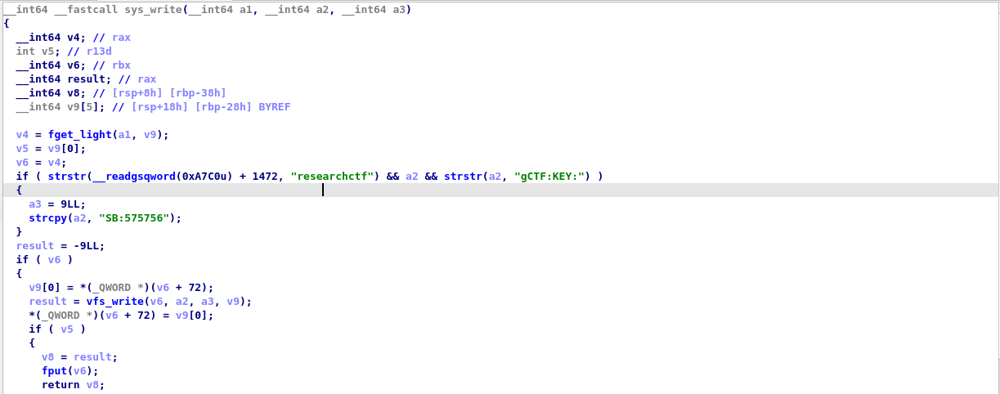
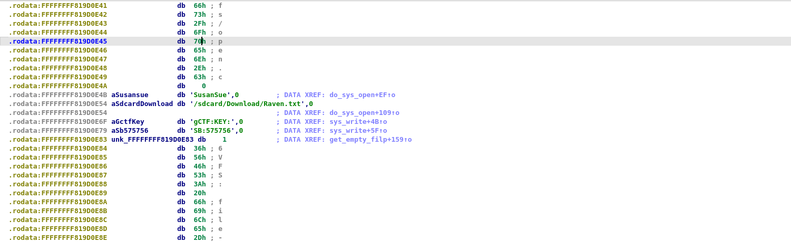

#  Johannesburg - Hideout 

  This is the ninth challenge of the Google Beginners Quest 2021.
  
### Challenge Description:
  Johannesburg is hot, and you are on your way to the secret lair. It seems like it is well fortified, even though you are expected under the alias of the assassin, perhaps it will be a better idea to sneak inside the lair, unseen? You climb up on a brick wall, and jump over it. On the other side you spot a lot of guards, quick, hide in a bush. Now you have to sneak past the guards into the main building's entrance.

  #### Challenge: Konski-Hiakawa Law of Droids:
   In this challenge, you have to find the flag using memory forensics. Good luck! Note, surround the flag with CTF{...} to submit it. Note, API Level 25 is what you're looking for.
   
   This challenge comes under the category of `reversing`.
   
   This challenge has a downloadable part.
   
### Solution:
  Upon extracting the zip file given, we get 4 files.
  
  ```bash
    ├── bzImage             Linux kernel x86 boot executable bzImage       
    ├── bzImage.elf         ELF 64-bit LSB executable, x86-64, version 1
    ├── bzImage.elf.i64     data
    └── gCTF.apk            Zip archive data
  ```
  
  Let's start from the top. `bzImage` is a copy of the linux kernel provided for reference. Not much use to us.
  `bzImage.elf` is the executable ELF file, again nothing much we can do about it.
  
  `bzImage.elf.i64` is a data file which can be opened in IDA debugger (.i64 is the IDA project file format).
  
  `gCTF.apk` is the apk that can be decompiled and reversed.
  
  **P.S. I couldn't upload the i64 file because the size is way to big for Github web to handle and I don't have the CLI right now.**
  
  On opening `bzImage.elf.i64` in IDA debugger (can be downloaded from [hex-rays.com](https://hex-rays.com/)), we can simply generate pseudo code by pressing
  F5 on the keyboard. On analyzing the code, we can see that gCTF:KEY is checked in the if condition and copied to a2.
  
  
  
  This text is the key we are looking for. Formatting it to CTF{...}, we get the flag for the challenge.
  
### Flag:
  Here is the final flag.
  
  
  #### FLAG(in text):
  ```
  CTF{SB:575756}
  ```
  
